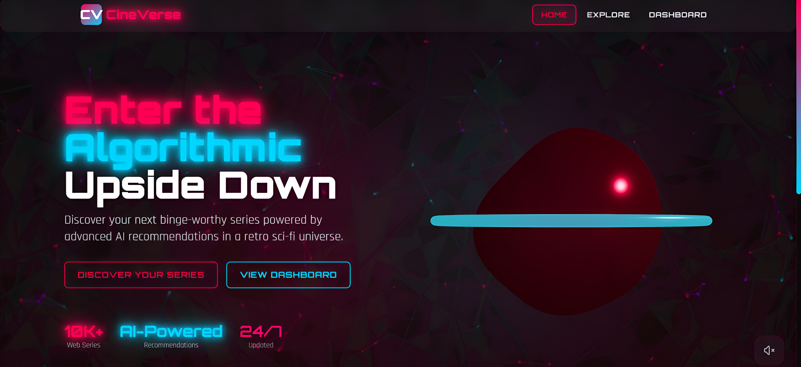

# CineVerse - AI Powered Web Series Recommendation Platform 🧿🫶

An AI-powered web series recommendation website with a stunning 80s retro sci-fi neon aesthetic inspired by Stranger Things. Built with Next.js 14, TypeScript, TensorFlow.js, and MongoDB.

🌐 Live Website: https://cineverseai.vercel.app/

## ✨ Features

### 🎨 Design
- **80s Retro Sci-Fi Aesthetic**: Dark black-to-red gradient with neon glowing typography
- **Glassmorphism UI**: Beautiful glass cards with backdrop blur effects
- **Animated Particles**: Dynamic background particle system
- **3D Portal**: Interactive Three.js 3D portal on homepage
- **Smooth Animations**: Framer Motion animations throughout
- **Responsive Design**: Fully optimized for mobile and desktop

### 🤖 AI-Powered Recommendations
- **Content-Based Filtering**: Using genre and keyword similarity
- **Cosine Similarity**: Vector-based recommendation algorithm
- **TensorFlow.js Integration**: Client-side machine learning
- **Personalized Recommendations**: Based on user watch history
- **Mood-Based Recommendations**: Get series based on your current mood
- **Similar Series**: Smart recommendations for each series

### 📺 Features
- **Vast Series Library**: Integration with TMDB API
- **Search & Filter**: Search by name, filter by genre
- **Series Details**: Complete information including cast, trailers, and ratings
- **User Watchlist**: Save your favorite series
- **Watch History Tracking**: Automatic tracking for better recommendations
- **YouTube Trailers**: Embedded trailers for each series

## 🚀 Tech Stack

- **Framework**: Next.js 14 (App Router)
- **Language**: TypeScript
- **Styling**: Tailwind CSS
- **Animations**: Framer Motion
- **3D Graphics**: React Three Fiber, Three.js
- **Machine Learning**: TensorFlow.js
- **Database**: MongoDB
- **API**: TMDB (The Movie Database)

